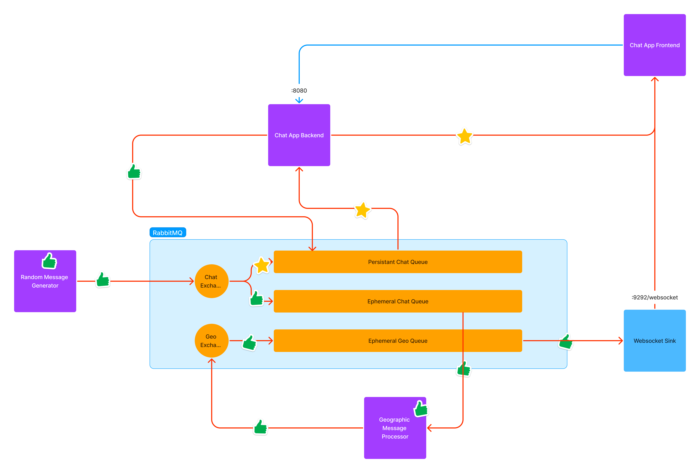

# Rabbit Messenger

## Introduction

## Getting started

1. Clone the repository
2. Run `docker-compose up -d` to start RabbitMQ and the other components
3. Open the necessary applications

    - RabbitMQ console at [localhost:15672](http://localhost:15672)

## Tasks