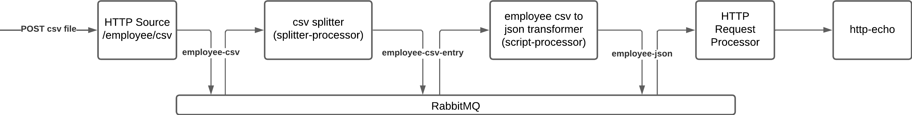

# Rabbit Messenger

## Introduction

## Getting started

1. Clone the repository
2. Run `docker-compose up -d` to start RabbitMQ and the other components
3. Using postman or similar application, post the csv file in the sample_data folder to `localhost:8081/employee/csv`
4. Notice you will see the post payloads in the `http-echo` logs, which is just listening for the http requests from the `http-out` component
5. You can also inspect or run the `bulk-message-processor` application with `./gradlew bootrun`.  This is an example of a custom procesor which bulk processes the csv as opposed to breaking it up first.  This example would likely be used in the scenario where the input file would not make logical sense to break up before processing.

### Notes
RabbitMQ console at [localhost:15672](http://localhost:15672)

